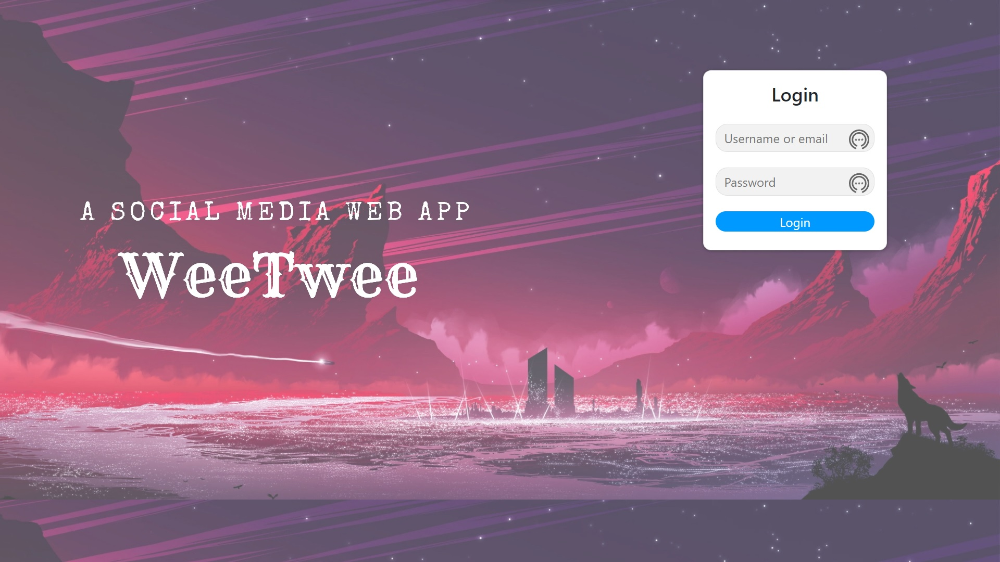

# WeeTwee

WeeTwee is a robust, institution-specific social media application designed to foster community engagement. It allows users to share thoughts, interact with peers via likes and comments, follow other users, and engage in real-time chat conversations. Built with a focus on updates and modern web standards.

## 🚀 Features

- **User Authentication**: Secure login and registration system.
- **Create Posts**: Users can create text-based posts to share with the community.
- **Interactions**: Like, retweet, and reply to posts to engage with content.
- **Real-time Chat**: Integrated socket.io for instant messaging between users.
- **Profiles**: customizable user profiles with profile pictures and cover photos.
- **Follow System**: Follow other users to see their posts in your feed.
- **Notifications**: user notifications for interactions (likes, replies, retweets).
- **Search**: Find users and posts easily.
- **Responsive Design**: Built with Bootstrap for mobile-friendly usage.

## 🛠️ Tech Stack

- **Frontend**: Pug (Template Engine), Bootstrap 5, Vanilla JS
- **Backend**: Node.js, Express.js
- **Database**: MongoDB (Mongoose ODM)
- **Real-time**: Socket.io
- **Authentication**: Sessions & Cookies

## 📦 Installation

1.  **Clone the repository**
    ```bash
    git clone <repository_url>
    cd WeeTwee
    ```

2.  **Install Dependencies**
    ```bash
    npm install
    ```

3.  **Environment Configuration**
    Create a `.env` file in the root directory and add the following variables:
    ```env
    PORT=3003
    MONGODB_URI=your_mongodb_connection_string
    SESSION_SECRET=your_secret_key
    ```

4.  **Run the Application**
    ```bash
    # Development mode
    npm run dev

    # Production mode
    npm start
    ```

5.  **Access the App**
    Open your browser and navigate to `http://localhost:3003`

## 📸 Screenshots



## 🤝 Contributing

Contributions, issues, and feature requests are welcome!

## 📝 License

This project is licensed under the ISC License.
